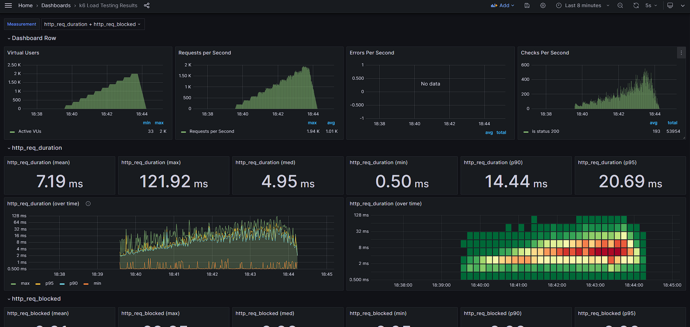
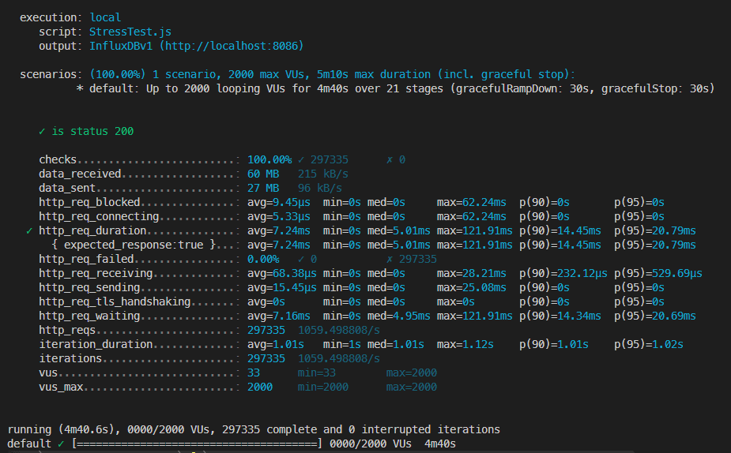

# Demo Load Testing with K6, InfluxDB and Grafana


## Components

- K6
- InfluxDB
- Grafana


## Configurations

### InfluxDB

```bash
docker exec -it <container_id> influx
```

**Show databases**
```bash
SHOW DATABASES
```

**Create database**
```bash
CREATE DATABASE <database_name>
```


### Grafana

#### Dashboard
- https://grafana.com/grafana/dashboards/2587-k6-load-testing-results/
- Id: 2587



### K6

**Run test**

```bash
k6 run StressTest.js -o influxdb=http://localhost:8086/k6
```

